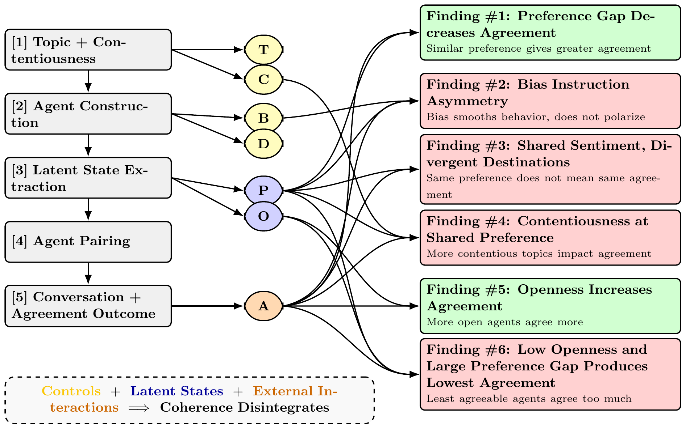

<div align="center">


## Are LLM Agents Behaviorally Coherent? Latent Profiles for Social Simulation

**James Mooney · Josef Woldense · Zheng Robert Jia · Shirley Anugrah Hayati · My Ha Nguyen · Vipul Raheja · Dongyeop Kang**  
University of Minnesota · University of Chicago · Grammarly

<p>
  <a href="https://arxiv.org/abs/2509.03736"></a>
  <a href="http://minnesotanlp.github.io/latent_profile"></a>
</p>



</div>

## Overview

Large language models are increasingly used as synthetic participants in social simulation. This repository evaluates whether such agents are **behaviorally coherent**: whether latent states elicited from an agent, such as topic preference and openness to persuasion, predict how that agent behaves in conversation.

The pipeline constructs demographic and topic-biased agents, elicits latent profiles, samples pairwise conversations over observed profile bins, judges agreement with an LLM evaluator, and runs statistical tests corresponding to the paper's behavioral hypotheses. The central result is that models often pass broad surface-level tests, but fail more granular coherence tests that require latent profiles to remain consistent across interaction.

## Method

The implementation follows the reference paper pipeline:

| Stage | Description |
| --- | --- |
| **Profile** | Generate demographic/persona-conditioned agents and elicit topic preference plus nine-item openness responses. |
| **Conversation** | Pair agents by observed preference, openness, and bias bins, then generate multi-turn topic conversations. |
| **Judge** | Score rolling conversation windows for agreement on a 1-5 scale using a calibrated LLM judge. |
| **Analysis** | Aggregate final agreement scores and run the six behavioral-coherence tests from the paper. |

The experiment configs use the paper-aligned settings: five turns per agent, a three-statement judge window, and `Qwen/Qwen3-32B` as the agreement judge.

## Running the Code

Python 3.12 is the tested runtime. Install dependencies with:

```bash
python -m pip install -r requirements.txt
```

The runner starts local OpenAI-compatible vLLM servers when `serving.enabled: true` in the config. Gated checkpoints may require Hugging Face access approval and `HF_TOKEN`/`HUGGING_FACE_HUB_TOKEN`.

Run a fresh paper-aligned experiment:

```bash
python pipeline.py run --config configs/experiments/core_fresh.yaml
```

Resume an interrupted run:

```bash
python pipeline.py resume --config configs/experiments/core_fresh.yaml
```

Run a single model or override the serving port:

```bash
python pipeline.py resume --config configs/experiments/core_fresh.yaml --model-ids 8 --skip-analysis --port 39001
```

Generate paper figures and tables from completed outputs:

```bash
python paper_analysis.py --mode all --experiment-name core_fresh --output-root /lustre/fs0/scratch/jmooney/latent_profile
```

Useful narrower analysis commands:

```bash
python paper_analysis.py --mode figures --experiment-name core_fresh
python paper_analysis.py --mode tests --experiment-name core_fresh
python paper_analysis.py --mode table --experiment-name core_fresh
```

For Slurm-based runs, submit one array task per configured model:

```bash
bash slurm/submit_pipeline_fresh_array.sh
```

Generated artifacts default to `/lustre/fs0/scratch/jmooney/latent_profile`. Override this with `LATENT_PROFILE_OUTPUT_ROOT` or the `output_root` field in the experiment config.

## Key Results

- Preference gaps behave coherently at the surface level: agents with more divergent elicited preferences tend to agree less.
- Higher aggregate openness also increases agreement in broad aggregate tests.
- Stronger, more granular tests reveal failures: bias instructions do not symmetrically amplify both agreement and disagreement.
- Shared negative sentiment can lead to different agreement behavior than shared positive sentiment, even with the same preference gap.
- Topic contentiousness can affect agreement even when elicited preferences are held fixed.
- Low-openness, high-disagreement cases do not reliably produce the lowest agreement, contrary to the behavioral expectation.

Overall, the results suggest that current LLM agents can imitate survey-style latent states while failing to preserve those states consistently in interactive social settings.

## Repository Structure

```text
.
├── main.py                  # Profile generation and latent-state elicitation
├── conversation.py          # Pair sampling and multi-turn agent conversations
├── judge.py                 # LLM-as-judge agreement scoring
├── analysis.py              # Lightweight aggregate summaries
├── paper_analysis.py        # Figures, tables, and six statistical tests
├── pipeline.py              # End-to-end runner and vLLM orchestration
├── configs/                 # Model registry and experiment configs
├── variations/              # Topics, demographic prompts, bias prompts, judge prompts
├── slurm/                   # DGX/Slurm launch scripts
├── docs/                    # Static project page and selected examples
└── paper/                   # Reference paper source, intentionally ignored
```

The `paper/` directory is reference material only. Experiment code should not write into it or depend on generated files inside it. Derived artifacts from `paper_analysis.py` are written under `analysis_outputs/paper_reference/` by default.

## Resources

The paper is available on arXiv:

- https://arxiv.org/abs/2509.03736

The project page is available at:

- http://minnesotanlp.github.io/latent_profile

## Citation

```bibtex
@misc{mooney2025llmagentsbehaviorallycoherent,
  title = {Are LLM Agents Behaviorally Coherent? Latent Profiles for Social Simulation},
  author = {Mooney, James and Woldense, Josef and Jia, Zheng Robert and Hayati, Shirley Anugrah and Nguyen, My Ha and Raheja, Vipul and Kang, Dongyeop},
  year = {2025},
  eprint = {2509.03736},
  archivePrefix = {arXiv},
  primaryClass = {cs.CL},
  url = {https://arxiv.org/abs/2509.03736}
}
```
